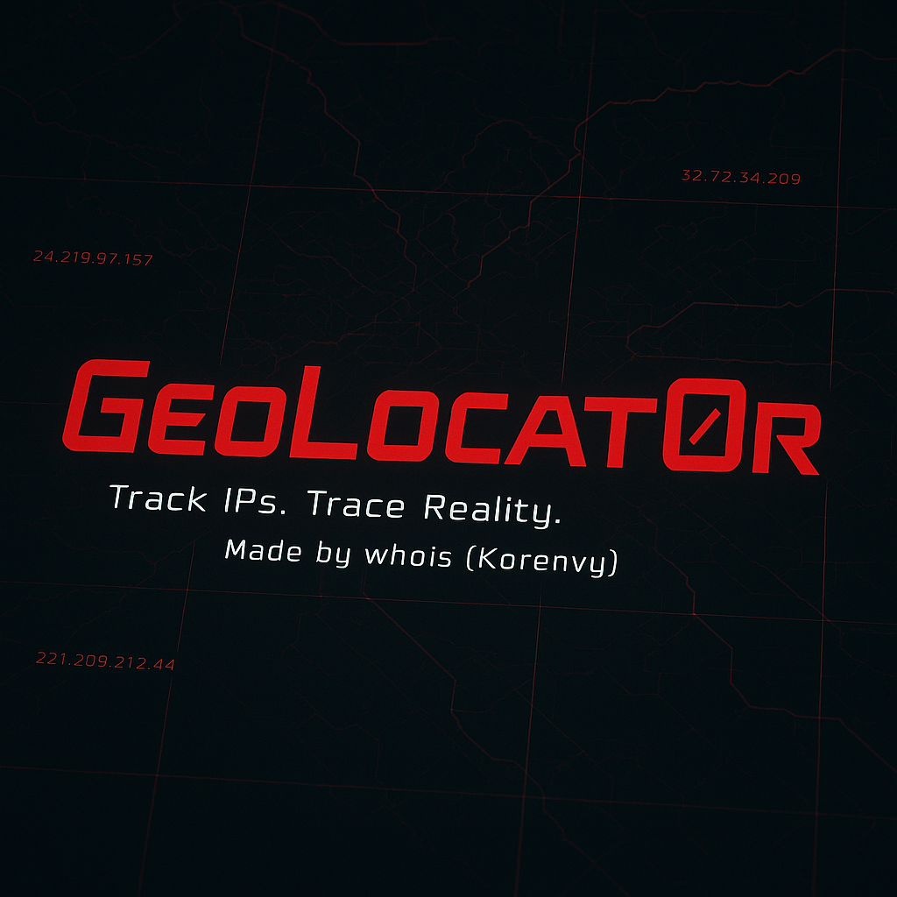

<p align="center">
  
  
  
  
</p>

```
 ██████╗ ███████╗ ██████╗      ██╗      ██████╗      ██████╗ █████╗  ██████╗ 
██╔════╝ ██╔════╝██╔═══██╗     ██║     ██╔═══██╗    ██╔════╝██╔══██╗██╔════╝ 
██║  ███╗█████╗  ██║   ██║     ██║     ██║   ██║    ██║     ███████║██║  ███╗
██║   ██║██╔══╝  ██║   ██║     ██║     ██║   ██║    ██║     ██╔══██║██║   ██║
╚██████╔╝███████╗╚██████╔╝     ███████╗╚██████╔╝    ╚██████╗██║  ██║╚██████╔╝
 ╚═════╝ ╚══════╝ ╚═════╝      ╚══════╝ ╚═════╝      ╚═════╝╚═╝  ╚═╝ ╚═════╝ 
               🌍 Geolocalizador IP/Dominio en Bash
```

# GeoLocat0r - Bash Edition

Herramienta de geolocalización para IPs y dominios, desarrollada en **Bash** para Termux, Kali Linux y cualquier distro Linux compatible con `curl` y `jq`.

---

## 🚀 Características principales

- ✅ Sin parámetros raros: solo ejecutás y escribís la IP o dominio.
- 🌐 Auto detección de IP pública si no ingresás nada.
- 🔒 Detecta IPs privadas y lo informa con contexto útil.
- 🎨 Salida con colores para mejor lectura.
- 🔧 Instalación automática de dependencias (`curl`, `jq`) si faltan.
- ⚙️ Compatible con Termux, Kali y más.

---

## 📥 Instalación

```bash
git clone https://github.com/Korenvy/GeoLocat0r-.git
cd GeoLocat0r-
chmod +x GeoLocat0r.sh*
```

---

## ⚙️ Uso

Ejecutá:

```bash
./GeoLocat0r.sh
```

Ingresá una IP o dominio, o dejalo vacío para geolocalizar tu IP pública.

---

## 📝 Ejemplo

```bash
Ingrese IP, dominio o deje vacío para su IP pública: 1.1.1.1

[+] IP: 1.1.1.1
[+] País: Australia
[+] Región: Queensland
[+] Ciudad: South Brisbane
[+] Código Postal: 4101
[+] Coordenadas: -27.4766, 153.0166
[+] ISP: Cloudflare
[+] Organización: APNIC and Cloudflare DNS Resolver project
[+] AS: AS13335 Cloudflare, Inc.
```

---

## 🧩 Requisitos

- `bash`
- `curl`
- `jq`
- `figlet` (opcional, solo para el banner)

> Si no tenés `curl` o `jq`, el script te los instala.

---

## ⚠️ Disclaimer

> Uso exclusivo con fines educativos. No nos hacemos responsables del mal uso.

---

## 👤 Autor

**Korenvy** (aka whois)  
GitHub: [korenvy](https://github.com/korenvy)  
Twitter: [@korenvy](https://twitter.com/korenvy)

---

💥 Si te sirvió, dejá una ⭐ en el repo
